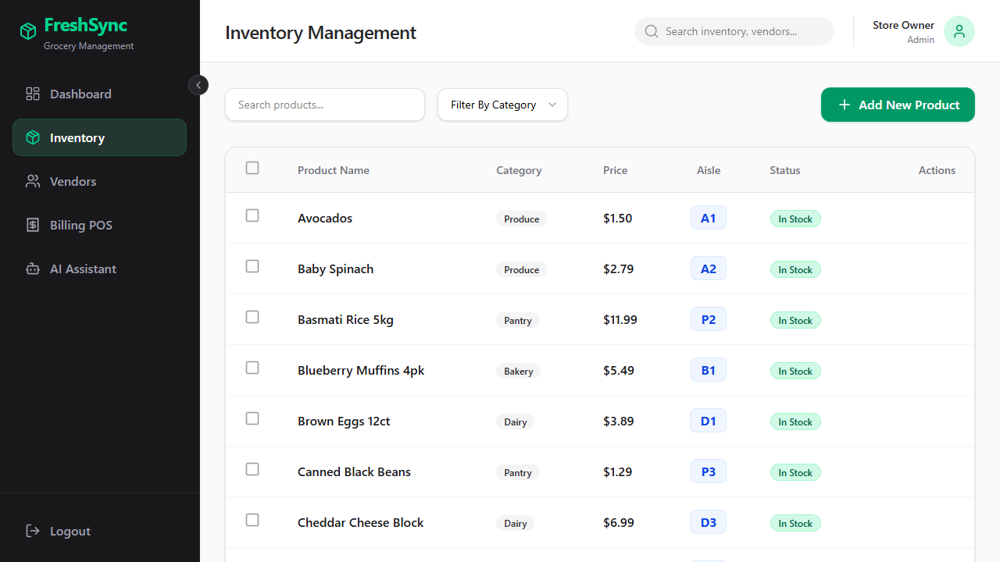
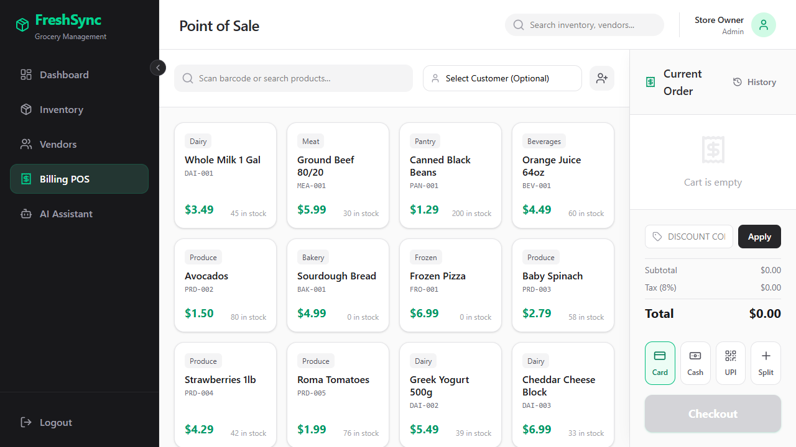

# FreshSync Grocery Management

FreshSync is a grocery store management app with:

- a `frontend` built with Vite + React
- a `backend` built with FastAPI
- Supabase for auth and data
- Gemini for the AI assistant

Live app:
- Frontend: https://retail-marketing.nlhrithik123.workers.dev/
- Backend: https://retail-marketing.onrender.com/

## What It Does

- Sign in and sign up with Supabase
- View a live dashboard with revenue, stock alerts, and deliveries
- Manage inventory and product stock
- View vendors and deliveries
- Use a billing POS to create sales
- Ask the AI assistant questions about sales, inventory, and deliveries

## Screenshots

### Inventory



### Billing POS



## Project Structure

```text
Retail-marketing/
|- frontend/   # Vite + React app
|- backend/    # FastAPI API
`- docs/images # README screenshots
```

## How The Flow Works

1. The frontend calls the backend through `frontend/src/api.ts`.
2. The backend handles auth and data access in `backend/main.py`.
3. Supabase stores users, products, customers, vendors, deliveries, and sales.
4. The AI assistant reads live store data from the backend and answers questions.

## Run It Locally

Open 2 terminals from the project root.

Frontend:

```powershell
cd frontend
npm install
npm run dev
```

Frontend runs on:

```text
http://localhost:3000
```

Backend:

```powershell
cd backend
python -m pip install -r requirements.txt
python -m uvicorn main:app --host 0.0.0.0 --port 8000
```

Backend runs on:

```text
http://localhost:8000
```

## Environment Variables

Backend `.env`:

```env
SUPABASE_URL=your_supabase_url
SUPABASE_KEY=your_supabase_service_role_key
GEMINI_API_KEY=your_gemini_api_key
APP_TIMEZONE=Asia/Kolkata
```

Frontend `.env`:

```env
VITE_API_URL=http://localhost:8000/api
```

Important:
- keep secrets only in `backend/.env`
- do not put secret keys in the frontend

## Deploy

Frontend:
- Cloudflare Workers/Pages
- root path: `frontend`
- build command: `npm install && npm run build`

Backend:
- Render
- root path: `backend`
- build command: `pip install -r requirements.txt`
- start command: `uvicorn main:app --host 0.0.0.0 --port $PORT`

## Demo Login

```text
admin@freshsync.com / admin123
customer@freshsync.com / customer123
```
